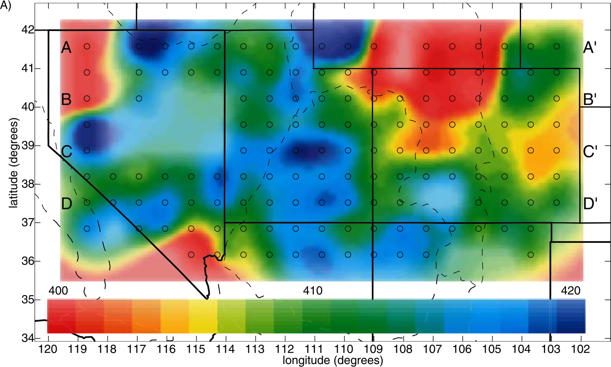
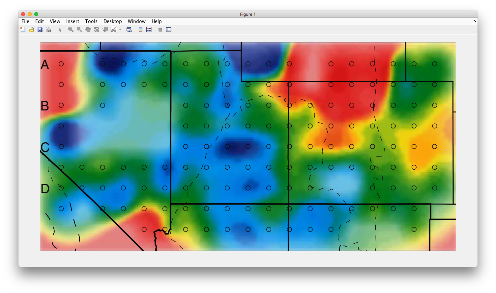
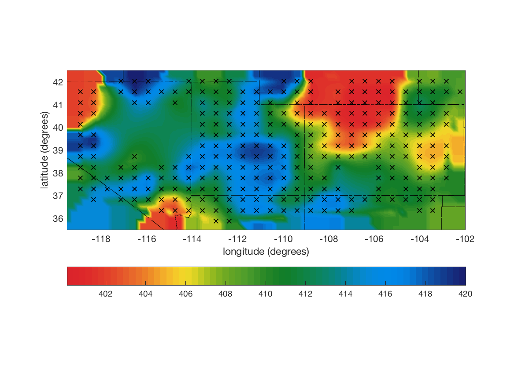
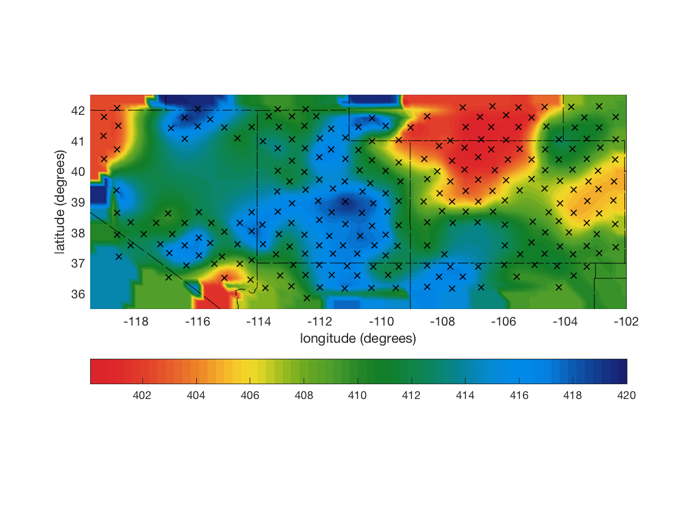
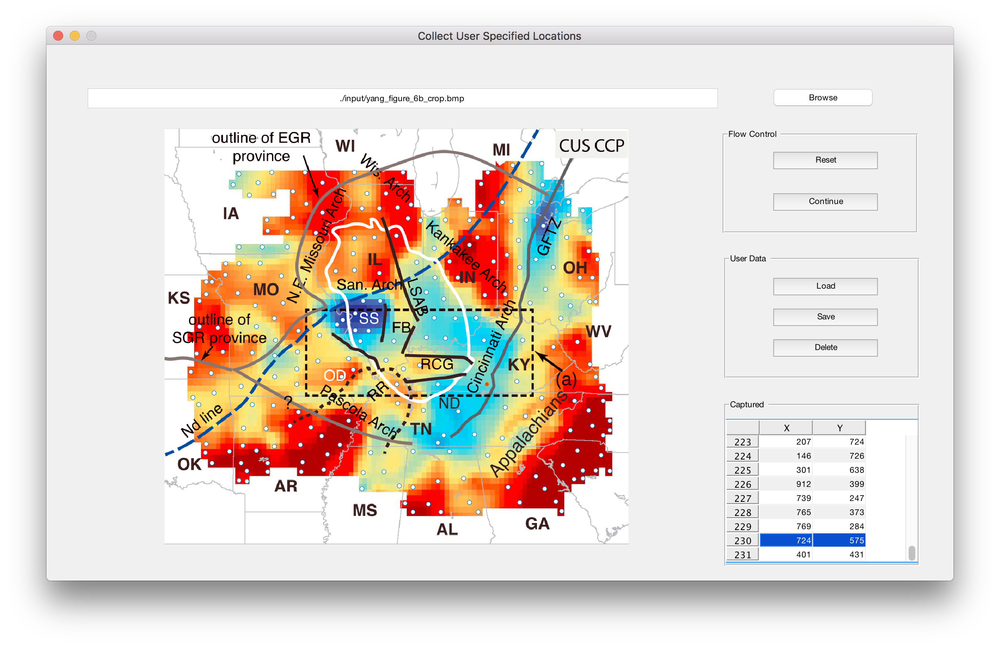
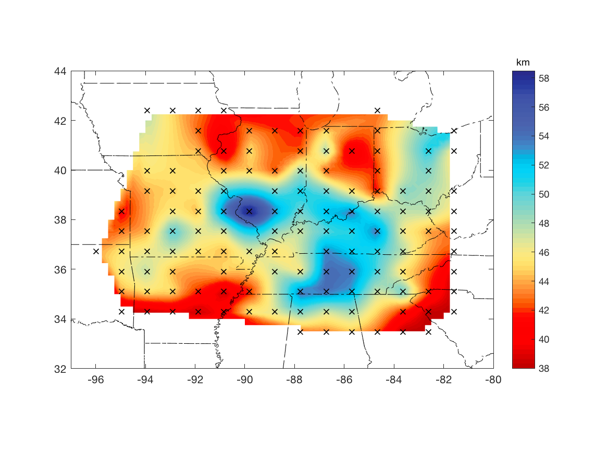
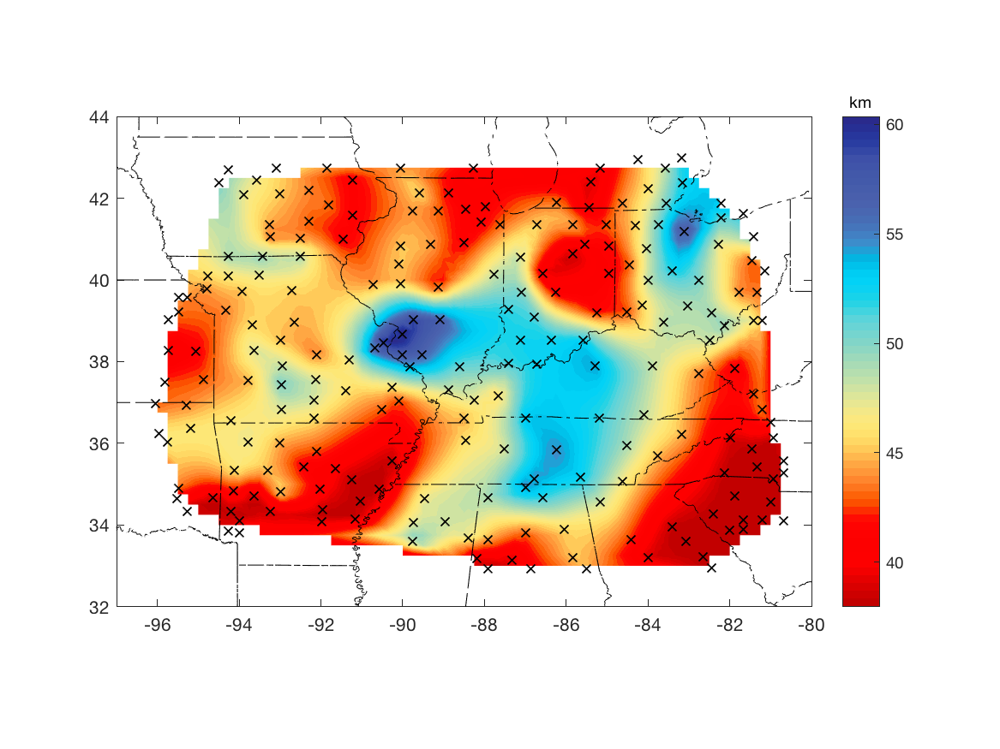

**Exact Digitizer**
<br> - *a MATLAB code for digitizing contour maps by color matching in the YUV colorspace*

[](https://travis-ci.org/vberger/silinapse)
[](https://coveralls.io/github/vberger/silinapse?branch=master)

Dependencies:
```
main.m
|
|-- ./borders/
|     |
|     |-- borders_documentation.m
|     |-- borders.m
|     `-- labelborders.m
|
`-- ./functions/
      |
      |-- cap_cursor.m
      |-- fuzzy_match.m
      |-- interp_cbar.m
      |-- process_img.m
      |-- refresh_axes.m
      |-- remake_cntr.m
      |-- set_locations.m
      `-- uv_distance.m
```
---
<!-- 
→ Example input map - depths to the 410 km discontinuity [Gilbert et al., 2003]:



→ Cropped image for digitization (`./input/gilbert_figure_6a_crop.png`):



→ User-provided digitized color scale (`./input/gilbert_colorbar.dat`):
```
 401 222  44  42
 402 226  66  42
 403 231  98  43
 404 237 135  40
 405 245 184  42
 406 236 215  39
 407 167 193  32
 408 108 168  35
 409  77 156  43
 410  40 135  39
 411  17 126  42
 412  15 131  70
 413  11 133 106
 414   6 132 158
 415   6 137 208
 416   1 137 230
 417   3 130 225
 418  11  94 182
 419  18  61 144
```
Once you have prepared these files, specify `cbar_lim`, `N_levels`, `X_range`, `Y_range`, `N_pixels`, and `dl`. Run `main.m` to perform digitization. Adjust the threshold for `fuzzy_match()` in `process_img.m` if necessary (the commented code block in `main.m` may help with this).

The sampled dataset will be saved as `./output/gilbert_digitized.dat`.

→ Digitized 410 km discontinuity (284 data points, showing the first 19 lines):
```
-117.128764  42.036278  418.730159
-116.532488  42.036278  420.000000
-115.936212  42.036278  419.365079
-114.147385  42.036278  412.698413
-113.551109  42.036278  409.523810
-112.954834  42.036278  409.523810
-112.358558  42.036278  412.063492
-109.973455  42.036278  419.365079
-109.377179  42.036278  418.412698
-108.780903  42.036278  401.269841
-106.992076  42.036278  401.587302
-106.395800  42.036278  401.587302
-105.799525  42.036278  401.587302
-105.203249  42.036278  401.587302
-104.010697  42.036278  408.253968
-103.414422  42.036278  407.936508
-102.818146  42.036278  409.206349
-118.917591  41.561514  402.222222
-118.321315  41.561514  402.539683
 ...
```
→ Remade contour map using auto-generated pixel locations:



→ Remade contour map using user-specified pixel locations:


 -->
> Digitization is something you may do only if you cannot get the raw data for creating a map!

Trying more examples...

→ The OIINK CUS Moho 2017 [Yang et al., 2017]<sup>[1]</sup>:


→ Collecting user-specified pixel locations (the collected data must be saved as `./output/yang_locations.dat`):



→ Remade contour map using auto-generated pixel locations:



→ Remade contour map using user-specified pixel locations:



[1] The dataset is available at [IRIS](https://ds.iris.edu/ds/products/emc-oiink_cus_moho2017/).

---

**Appendix**

Method for doing the YUV conversion (`uv_distance.m`):
```
| Y'|   |  0.299    0.587    0.114   | | R |
| U | = | -0.14713 -0.28886  0.436   | | G |
| V |   |  0.615   -0.51499 -0.10001 | | B |
```
List of parameters and their meanings:
```matlab
% interp_cbar.m
cbar_lim = [38, 62];  % limits for interpolating the color scale
N_levels =  64;       % the number of levels in the interpolated color scale

% main.m
X_range = [-97, -80];  % area of the real map
Y_range = [ 32,  44];  % they must define your cropped image tightly

% process_img.m
N_pixels  = ceil(N_row/15);  % pixels you'd like to skip along each axis
threshold = 20;  % threshold for excluding exceptional pixels
                 % measured as distance in the YUV colorspace

% remake_cntr.m
dl = 0.25;  % interval for presenting the remade digit map
```
**References**
* [Makima Piecewise Cubic Interpolation](https://blogs.mathworks.com/cleve/2019/04/29/makima-piecewise-cubic-interpolation/)
* [Pixel color values](https://www.mathworks.com/help/images/ref/impixel.html)
* [Define World Coordinate System of Image](https://www.mathworks.com/help/images/define-world-coordinates-using-spatial-referencing.html)
* [How to compare two colors for similarity/difference](https://stackoverflow.com/questions/9018016/how-to-compare-two-colors-for-similarity-difference)
* [Algorithm to check similarity of colors](https://stackoverflow.com/questions/5392061/algorithm-to-check-similarity-of-colors)
* [YUV Colorspace](https://softpixel.com/~cwright/programming/colorspace/yuv/)
